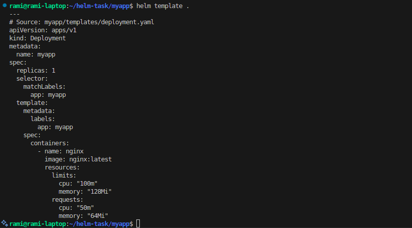

# Helm Chart Project

This repository contains a Helm chart for deploying a application to Kubernetes.

## Project Structure



## Helm Template Output

The following image shows the output of running the command:
```bash
helm template . -f override-resources.yaml
```


## Chart Structure

```
myapp/
├── Chart.yaml         # The chart's definition file
├── values.yaml       # The default configuration values for this chart
├── charts/          # Directory for chart dependencies
└── templates/       # Directory for template files
    ├── _helpers.tpl    # Template helpers
    └── deployment.yaml # Kubernetes deployment template
```

## Prerequisites

- Kubernetes cluster
- Helm v3.0+

## Installation

To install the chart with the release name `my-release`:

```bash
helm install my-release ./myapp
```

## Configuration

The following table lists the configurable parameters of the chart and their default values. To override any of these values, specify each parameter using the `--set key=value[,key=value]` argument to `helm install`.

For detailed information about the configuration options, please check the `values.yaml` file.

## License

This project is licensed under the MIT License - see the LICENSE file for details.
